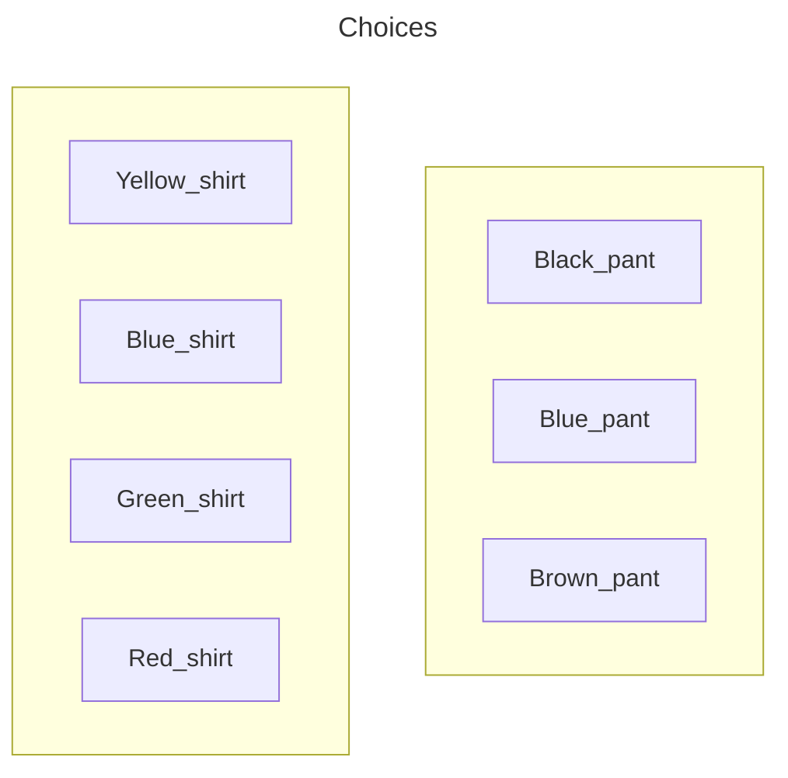
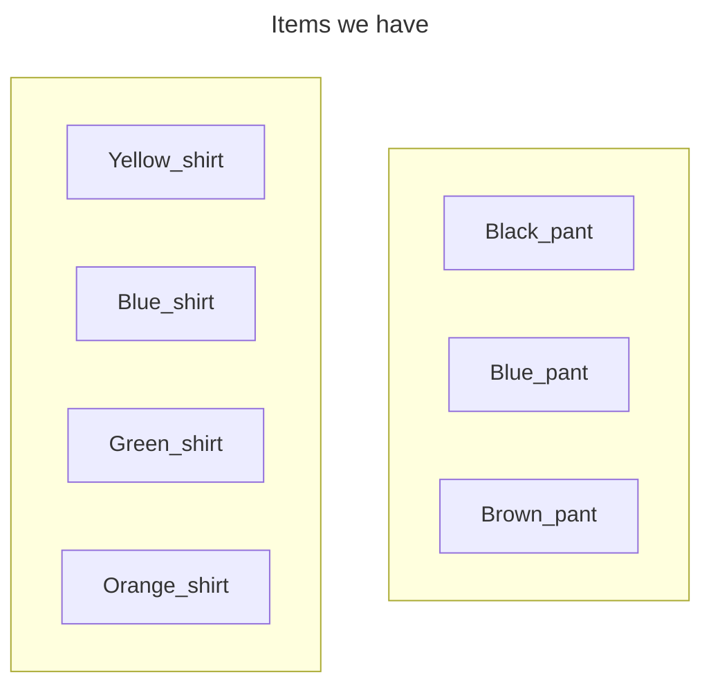
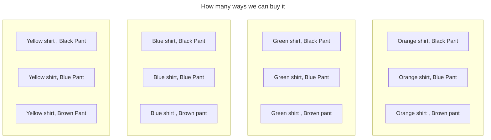

# Permutations_&_Combinations

## Basic Countings

**The Addition rule of Counting**

You have a gift ard withs that you can buy one item from the store, either a shirt or a pant 

The options you have are

you have Four choices for buying a shirt or you have Three choices for buying a pant. If you Choose to buy a shirt(pant), you can't buy a pant(shirt)

Hence, the total choices available are 4+3=7

**The Addition rule of counting**

<mark> 
If an action A can occur in n1 different ways, another action B can occur in n2 different ways, then the total number of occurrence of the actions A or B is n1+ n2.
</mark>

---

**Multiplaction rule of counting**

Suppose now your card allows you to buy one shirt and one pant how many choices do you have?

---

---

3 + 3 + 3 + 3 = 12

.png>)

now we are just adding Shoes like now you can select one shirt , one pant and one shoe

now we have 12 + 12 = 24 options

**The Multiplaction ruleof counting**

<mark>If an action A can occur in n1 different ways, antoher action B can occur in n2 different ways, then the total number of occurence of the action A **and** B together in n1 * n2.</mark>

1. Addition rule ==> add everything  
1. Multiplactoin rule ==> add everything in action A and add everything in action B and Multiply A and B

Addition ==> OR  
Multiplaction ==> AND

---
**Application of Countings**

1. Suppose you are asked to create a six digit alpha numeric password with the following requirement:
1. The password should have first two letters followed by four numbers.
1. Repetation allowed
    > Number of ways- 26 x 26 x 10 x 10 x 10 x 10 = 6,760,000
1. Repetation Not allowed
    > Number of ways- 26 x 26 x 10 x 9 x 8 x 7 = 3,276,000

---

## Factorials

Factorial is the product of all positive integers from 1 up to a specific number. It is written using an exclamation point (n!).

$$3! = 3 \times 2 \times 1 = 6$$
$$4! = 4 \times 3 \times 2 \times 1 = 24$$
$$6! = 6 \times 5 \times 4 \times 3 \times 2 \times 1 = 720$$

## Permutations

**Definition**  
<mark>
A permutation is an orderd arrangement of all or some of n objects.</mark>

A permutation is just a fancy word for the number of ways you can arrange things in a specific order.

**The Formula**

**<mark>Permutation = nPr</mark>**

$${^n}P_r= \frac{n!}{(n - r)!}$$

**Variables:**
*   **$n$**: Total number of items in the group.
*   **$r$**: Number of items you are selecting to arrange.
*   **$!$**: Factorial (multiply the number by all positive integers below it).

---

### Example: The Executive Board
Suppose a club has **10 members**. They need to elect a **President**, a **Vice President**, and a **Secretary**. 

Since the roles are specific, the order in which people are picked matters (being President is different from being Secretary).

**1. Identify the values:**
*   $n = 10$ (Total members)
*   $r = 3$ (Positions to fill)

**2. Apply the formula:**
$$P(10, 3) = \frac{10!}{(10 - 3)!} = \frac{10!}{7!}$$

**3. Solve the math:**
*   $10! = 10 \times 9 \times 8 \times 7 \times 6 \times 5 \times 4 \times 3 \times 2 \times 1$
*   $7! = 7 \times 6 \times 5 \times 4 \times 3 \times 2 \times 1$
*   By canceling out the $7!$ from the top and bottom:
*   $10 \times 9 \times 8 = \mathbf{720}$

> Note: never divide the 10! and 7! directoly like dividing numerics  
    > 1. bring them into saperate factorial form and then divide (or)
    > 2. Convert factorial into numerical and then divide them

**Result:** There are **720 different ways** to choose that three-person leadership team.

### Permutations(Objects not distinct)

  

**Arranging Items with Repeats**

When you have a group of items where some are **exactly the same**, you have fewer ways to arrange them because swapping two identical items doesn't create a new look.

**📐 The Rule**
To find the total arrangements, take the total number of items and divide by the "repeats."

**The Formula:**
$$\frac{n!}{r!}$$
*(Total items factorial ÷ Repeat items factorial)*

---

**💡 Example: The word "EGG"**
How many different ways can you arrange the letters in the word **EGG**?

1.  **Count the letters:** There are **3** letters total ($3!$).
2.  **Identify repeats:** The letter **G** shows up **2** times ($2!$).

**The Calculation:**
$$\frac{3 \times 2 \times 1}{2 \times 1} = \frac{6}{2} = 3$$

**The 3 unique arrangements are:**
*   EGG
*   GEG
*   GGE

*(Without the repeat, there would have been 6 ways, but because the G's are identical, we only get 3.)*

### Permutation (Circular Permutaion)

Formula = <mark>**(n-1)!**</mark>

**💡 The Layman Explanation**
Imagine 3 friends—**A, B, and C**—sitting at a round table.
*   In a straight line, **ABC** and **BCA** are different. 
*   In a circle, **ABC** and **BCA** are identical because everyone still has the same person to their left and right.
*   To fix this, we "lock" one person in a seat to create a reference point. Then, we only arrange the remaining people.

**📝 Example: Dinner Party**
How many ways can **5 people** sit around a circular dinner table?

1.  **Identify n:** There are 5 people.
2.  **Apply Formula:** $$(5 - 1)! = 4!$$
3.  **Solve:** $$4 \times 3 \times 2 \times 1 = 24$$

**Result:** There are **24 unique ways** to seat them.

## Combinations

**1. Layman Explanation**
A **Combination** is a way of selecting items where the **order does not matter**. You are simply choosing a group. If you swap the items around, it is still the exact same selection.

**2. Formula**
The formula for combinations is:
$${^n}C_r = \frac{n!}{r!(n - r)!}$$

*   **n**: Total items to choose from.
*   **r**: How many items you are choosing.

**3. Simple Example: Toppings**
You are at a pizza shop and can choose **2 toppings** from a list of **5** (Pepperoni, Mushroom, Onion, Sausage, Peppers).

If you pick **Pepperoni and Mushroom**, it is the same pizza as **Mushroom and Pepperoni**. 

**The Math:**
$${^5}C_2 = \frac{5!}{2!(3!)} = \frac{120}{2 \times 6} = \frac{120}{12} = 10$$

There are **10 possible ways** to choose your two toppings.

