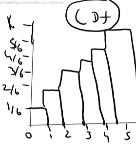

# Probability

## Probability Distribution Function

> Probability distribution function describes how proobabilities are distributed over the values of a random variable

1. PMF (Probability Mass Function) --> discrete random variables
1. PDF (Probability Density Function) --> Continues random variables
1. CDF (Cumalitive Distributive Function)

<b><u>PMF(Probability Mass Function)</u></b>

**Rolling a Dice**

x = {1,2,3,4,5,6}

pr(1) = pr(2) = pr(3) = pr(4) =pr(5) = pr(6) = 1

**PMF**

<b><u>Eg:</b></u>

**CDF**

## Distributions

Types of Distributions (PMF, CDF, PDF)

	1. Bernoulli Distribution --> (0,1) (PMF)
	2. Binomial Distribution --> (0,1) (PMF)
	3. Normal / Gaussian Distribution -->  (PDF)
	4. Log normal Distribution --> (PDF)
	5. Uniform Distribution --> (PMF)
    6. etc....

 
 ### Bernoulli Distribution (PMF)

**Example**

**Product Sale**

Users = 60% = **P**  
Non Users = 40% = (1-p) = **Q**

**$$PMF= p^k  (1 - p)^{(1-k)}$$**

### Binomial Distribution (PMF)

**$$PMF = {^n}C_K P^K (1-p)^{(n-k)}$$**

Imagine you are shooting 10 free throws and you want to find the chance of making exactly 7 of them. Your career average for making a shot is 80%.  
1. (n = 10): You are taking 10 shots.  
1. (k = 7): You want to know the probability of making 7.  
7. (p = 0.8): Your 80% success rate per shot.  

### Poisson Distribution(PMF)

How many times a perticular event is done in a given time

Example
How many Cricket matches have you played in one hour

**Definition**
Number of events occuring in a Perticular interval of time

**$$PMF= (e^{-λ} * λ^{x}) / x!$$**

x = time  
$\lambda$ = number of times event occurs

<u>**example**</u>

$\lambda$ = 4
x = 12pm

$$PMF= (e^{-4} * 4^{12}) / 12!$$
$$=0.00064$$

### Normal/Gaussian/Semetric Distribution(PDF)

This Distribution forms a bell curve and the top most point of the bell is the mean  
The Mode and the Median is equal

$$PDF = \frac{1}{\sigma\sqrt{2\pi}} e^{-\frac{1}{2}}(\frac{x_i - \mu}{\sigma})^2$$

$\mu$ = Mean

**Emperical rule=68-95-99**

### Standard Normal Distribution

In normal distribution we have some value as mean and the standard Normal Distribution sets the $\mu$ = 0 and $\sigma$ = 1.

For changing the Normal distributin to Standard Normal Distribution we use **Z-score**

$$ZScore = \frac{x_i - \mu}{\sigma}$$

**Example**

If we have x={1,2,3,4,5}

Applay z-score formula
$(1-3)/1$ = -2  
$(2-3)/1$ = -1   
etc...

The new x will be x={-2,-1,0,1,2}

**<mark>This process is called Standardizaton </mark>**

### Uniform Distribution

1. Continuous Uniform Distribution (PDF)
1. Discrete Uniform Distribution (PMF)

#### Continuous Uniform Distribution (PDF)

In Continuous Uniform Distribution we have a perticular interval like between two points a and b, **in between that interval a and b we will get our outcomes Continuous Uniform Distribution**

**PDF**
$$f(x) = \begin{cases} \frac{x_2 - x_1}{b - a} & \text{for } x \in [a, b] \\ 0 & \text{otherwise} \end{cases}$$

**CDF**

$$CDF = \begin{cases} \frac{x - a}{b - a} & \text{for } x \in [a, b] \\ 0 & \text{for } x < a \\ 1 & \text{for } x > b \end{cases}
$$

#### Discrete Uniform Distribution

$$PMF = \frac{1}{n}$$

### <mark>Log Normal Distributino</mark>

**PDF**

$$f(x) = \frac{1}{x\sigma\sqrt{2\pi}} e^{-\frac{(\ln x - \mu)^2}{2\sigma^2}}
$$

**CDF**

$$F(x) = \Phi\left(\frac{\ln x - \mu}{\sigma}\right)$$

To change a Lognormal distribution into a Normal distribution, you simply apply the natural logarithm ($\ln$) to your data.

**The Simple Rule**
If you have a set of numbers ($x$) that are Lognormally distributed:
1. Take the natural log of every number: $y = \ln(x)$.
2. The new set of numbers ($y$) will now follow a **Normal Distribution**.

---

**Why does this work?**
Lognormal data is "bunched up" near zero and has a long tail of very high numbers (it is **skewed**). Taking the log "squashes" the giant numbers and "stretches" the small ones, making the data look like a symmetrical **Bell Curve**.

---

**Real-World Example: Income 💰**
* **Lognormal (Raw Data)**: Most people earn a modest amount, but a few billionaires create a massive "tail" to the right. 
* **Normal (Log-Transformed)**: If you take the log of everyone's income, the billionaires move closer to the average, and the data becomes a balanced Bell Curve.

---

**The Inverse (Going Back)**
If you have Normal data and want to make it Lognormal, you do the opposite:
* **Use Exponentiation**: $x = e^y$

### Power law Distribution

it follows the 80 20 rule

after seeing the **Power law Distribution** we need to conver thme into normal distribution using BoxCox Transformation

**BoxCox Formula**
$$y(\lambda) = \begin{cases} \frac{x^\lambda - 1}{\lambda} & \text{if } \lambda \neq 0 \\ \ln(x) & \text{if } \lambda = 0 \end{cases}
$$

### Pareto Distribution

for Pareto Distribution also we use BoxCox Technique to convert it into Normal Distribution

## <mark>Central Limit Theorem</mark>

It relies on concept of sampling distribution, which probability distribution for a lareg number of samples taken from a populatino  
It says that sampling distribution of the mean will always be normally distributed, as long as the sample size is large enough. regardless whether the population follows binomial, poission, normal or any other distribution, the sample will always follow normal distribution

> in simple words this Centeral limit Theorem says plot a the sample data taken from a population data the sample data should be in normal distribution irrespective of the disribution type of the population data (Population distribution might be any distribution but the sample created from Population should be in normal distribution)

## Estimates

it is  a specified observed numerical value used to estimate an unknown population parameter

