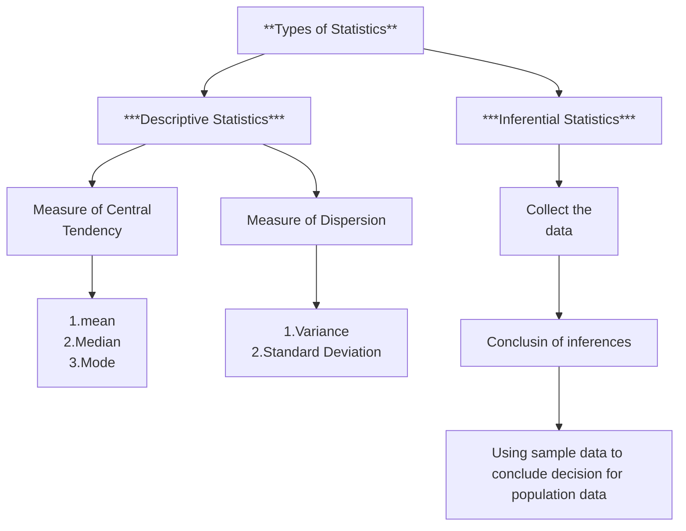
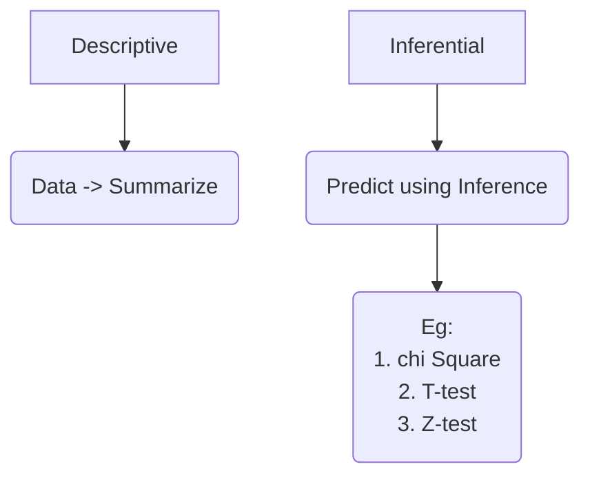
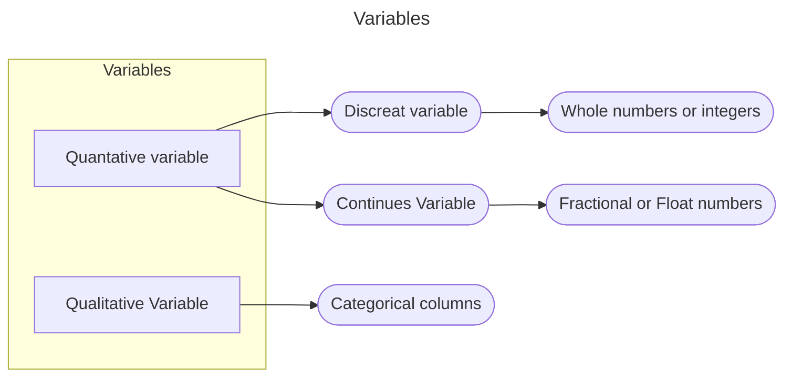
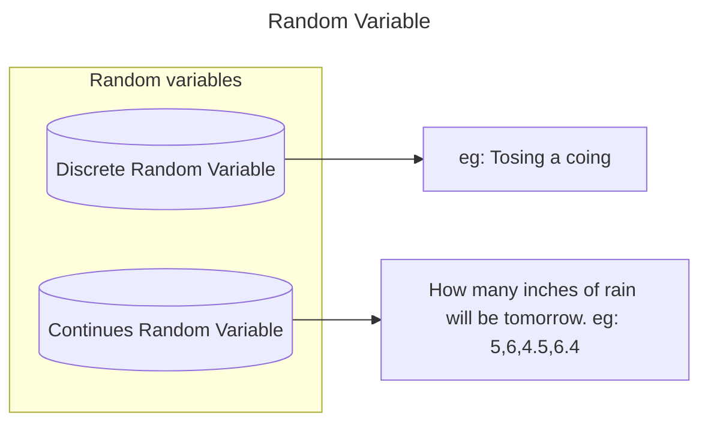
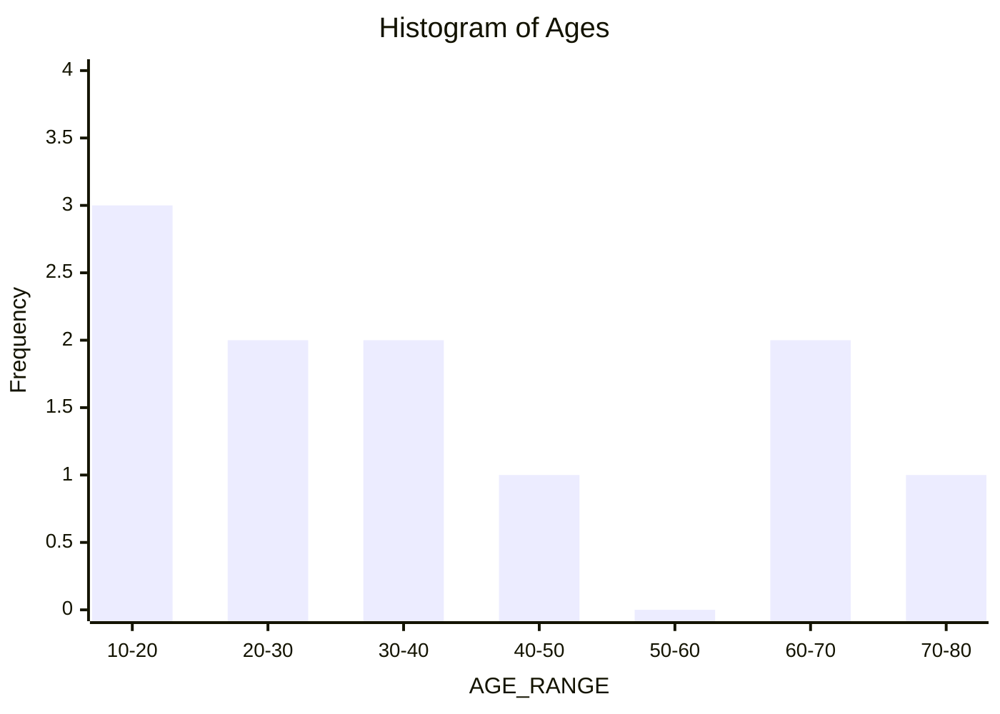
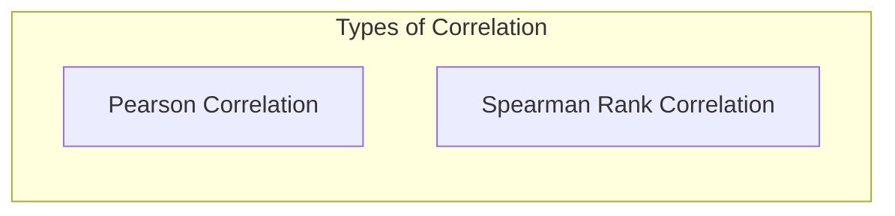

# Statistics

Statistics is a field that deals with collection, organization, analysis, interpretation and presenting of the data

eg: Age={24,27,44,56,28,29,32}

**Population Vs Sample Data**

Population is a whole data we have and the sample is the part of the Population data, there are diffrent types of sampling techniques to get sample data

From the sample data ver created first the descriptive statistics is performed and after that inferential statistics is performed to predict  using  1. T-test  2. Z-test   3. Che-square test  and other methods

Sample --> n  
Population --> N

# Descriptive Statistics

## Measure of Central Tendency
1. Mean
1. Median
1. Mode

Mean = Average = µ

**Population Mean**
$$\mu = \frac{\sum_{i=1}^{n} x_i}{N}$$

**Sample Mean**
$$\mu = \frac{\sum_{i=1}^{n} x_i}{n}$$

---
***Example***

**1.Mean**
$$
\begin{aligned}
\mu &= \frac{\sum_{i=1}^{4} x_i}{4} \\
&= \frac{1 + 3 + 4 + 5}{4} \\
&= \frac{13}{4} \\
&= 3.25
\end{aligned}
$$
> Finding mean gives the accurate midpoint of the give data when the ourliers is low

**2.Median**
 
**Data Set:**
$$Ages = \{1, 3, 4, 5, 100\}$$
**Mean Calculation:**
$$
\begin{aligned}
\bar{x} &= \frac{1 + 3 + 4 + 5 + 100}{5} \\
&= \frac{113}{5} \\
&= 22.6
\end{aligned}
$$
**Median calculation**

Median = Middle value of the dataset

$$Median = 4$$
> **Note:** While the average is **22.6**, the **Median** (middle value) of this set is actually **4**. We use Median insted of using Mean is when the Outliers is high in other words when the numbers in the data varies very high.

**3.Mode**
The mode is the value that occurs most often in the data set.

**Data Set (Ages):**
$$Ages = \{1, 3, 4, 4, 5, 100\}$$

**Finding the Mode:**
* The value **4** appears two times.
* All other values appear only once.

**Result:**
$$\text{Mode} = 4$$

---

## Measure of Dispersion
1. Variance
1. Standard Deviation

**Variance**

variance is a measurement of how spread out <mark> a set of numbers is from their average (mean)</mark>. It helps you understand if data points are clustered closely together or scattered widely.

**Populatoin**
$$\sigma^2 = \frac{\sum_{i=1}^{N} (x_i - \mu)^2}{N}$$

**Sample**
$$s^2 = \frac{\sum_{i=1}^{n} (x_i - \bar{x})^2}{n - 1}$$

> The x bar also denotes mean the x bar is specialy used for sample mean

> we use n-1 insted of n is to avoid under estimation. This is called as Bessel correction (Degree of freedom)

**Standard Deviation**

Standard deviation is <mark>a statistical measure that tells you how far, on average, each data point in a set is from the mean (average)</mark>. While variance gives you a mathematical sense of spread, standard deviation is the "go-to" for practical use because it is expressed in the same units as your original data (e.g., kilograms, meters, or dollars).

---
Example:

**Example: Calculating Sample Variance**

**Data Set:** $x = \{3, 7, 8\}$  
**Sample Size ($n$):** $3$

**Step 1: Find the Mean ($\bar{x}$)**
$$\bar{x} = \frac{3 + 7 + 8}{3} = 6$$

**Step 2: Calculate Deviations**
To find the variance, we calculate how far each value is from the mean ($6$).

| $x_i$ | $(x_i - \bar{x})$ | $(x_i - \bar{x})^2$ |
| :--- | :--- | :--- |
| 3 | $3 - 6 = -3$ | 9 |
| 7 | $7 - 6 = 1$ | 1 |
| 8 | $8 - 6 = 2$ | 4 |
| **Sum ($\sum$)** | | **14** |

**Step 3: Apply the Formula**
Using the Sample Variance formula $s^2 = \frac{\sum (x_i - \bar{x})^2}{n - 1}$:

$$
\begin{aligned}
s^2 &= \frac{14}{3 - 1} \\
&= \frac{14}{2} \\
&= 7
\end{aligned}
$$

**Result:** The Sample Variance ($s^2$) is **7**.

---

|   |Population(N)|Sample(n)|
|:---:|:---:|:---:|
|Mean| $\mu$ | $\bar{x}$|
|Variance| $\sigma^2$ | $s^2$|
|Standard deviation| $\sqrt{\sigma^2}$ |$\sqrt{s^2}$ |

---

## Variables

## Random Variable

## Histogram

**Histogram Data**

**Ages Set:**
$Ages = \{11, 15, 18, 22, 25, 34, 40, 45, 68, 69, 70, 75\}$

**Bin Size:** 10

| Age Range (Bins) | Frequency |
| :--- | :--- |
| 10 - 20 | 3 |
| 20 - 30 | 2 |
| 30 - 40 | 2 |
| 40 - 50 | 1 |
| 50 - 60 | 0 |
| 60 - 70 | 2 |
| 70 - 80 | 1 |

## Percentiles & Quantails

Percentile indicates the value below which a given percentage of observations in a dataset fall

A Percentile is a score that tells you what percentage of the data falls at or below a certain value. It is used to understand how a specific value compares to the rest of the group.  If you are in the 90th percentile, it means you performed better than (or equal to) 90% of everyone else.

> Percentage is your actual score (e.g., I got 80/100).Percentile is how you did compared to others (e.g., my 80 was better than 90% of the class).

---

**The Formula**

To find the percentile rank of a specific value ($x$):

$$P = \left( \frac{\text{Number of values } \leq x}{\text{Total number of values (n)}} \right) \times 100$$

---

**Practical Example: Class Test Scores**

**Data Set (Sorted):** 
Imagine 10 students scored the following on a quiz:
$$Scores = \{55, 60, 65, 70, 75, 80, 85, 90, 95, 100\}$$

**Goal:** Find the percentile rank for a score of **80**.

**Step 1: Count values $\leq$ 80**
Counting from the start: $55, 60, 65, 70, 75, 80$.  
There are **6** values.

**Step 2: Total number of values**
There are **10** students ($n = 10$).

**Step 3: Calculate**

$$
\begin{aligned}
P &= \frac{6}{10} \times 100 \\
P &= 0.6 \times 100 \\
P &= 60
\end{aligned}
$$

**Result:** A score of 80 is in the **60th percentile**. This means the student did as well as or better than 60% of the class.

---

**Important Landmarks**
| Percentile | Name | Description |
| :--- | :--- | :--- |
| **25th** | First Quartile ($Q_1$) | The "bottom" 25% of data. |
| **50th** | **Median** ($Q_2$) | The exact middle of the data. |
| **75th** | Third Quartile ($Q_3$) | The "top" 25% of data. |

> **Percentile vs. Percentage:** A percentage tells you your score ($80\%$). A percentile tells you your rank (better than $60\%$ of others).

**Five number summary**

1. Minimum
1. 1st Quartile (25 percentile) => Q1
1. Median
1. 3rd Quartile (75 percentile) => Q2
1. Maximum

**Inter Quartile Range(IQR)**

IQR = Q3 - Q1

Lower fence = Q1 - 1.5(IQR)

Higher fence = Q3 + 1.5(IQR)

EG: {$1, 2, 2, 2, 3, 3, 4, 5, 5, 5, 5, 6, 6, 6, 6, 6, 7, 8, 8, 9, 27$}

**Total Count ($n$):** 21

---

**The Five-Number Summary**
This summary uses percentiles ($0^{th}, 25^{th}, 50^{th}, 75^{th}, 100^{th}$) to describe the spread of your data.

| Measure | Value | Description |
| :--- | :--- | :--- |
| **Minimum** | 1 | The smallest value. |
| **$Q_1$** (25th) | 3 | The middle of the first half. |
| **Median** ($Q_2$) | 5 | The exact middle of the set. |
| **$Q_3$** (75th) | 6 | The middle of the second half. |
| **Maximum** | 27 | The largest value (Potential Outlier). |

---

**Finding the IQR (Interquartile Range)**
The IQR tells you where the "middle 50%" of your data lives.
$$
\begin{aligned}
IQR &= Q_3 - Q_1 \\
&= 6 - 3 \\
&= 3
\end{aligned}
$$

> The value **27** is much higher than the rest. In your notes, you might want to label this as an **Outlier**, as it will heavily pull the Mean away from the Median.

**1. The Lower Fence**

The boundary for unusually small values.
$$
\begin{aligned}
\text{Lower Fence} &= Q_1 - (1.5 \times IQR) \\
&= 3 - (1.5 \times 3) \\
&= 3 - 4.5 \\
&= -1.5
\end{aligned}
$$

**2. The Upper Fence (Higher Fence)**
The boundary for unusually large values.
$$
\begin{aligned}
\text{Upper Fence} &= Q_3 + (1.5 \times IQR) \\
&= 6 + (1.5 \times 3) \\
&= 6 + 4.5 \\
&= 10.5
\end{aligned}
$$

---

**Outlier Check**
Now we compare our data set $\{1, 2, \dots, 9, 27\}$ to these fences:
*   **Lower Limit (-1.5):** No values are smaller than -1.5.
*   **Upper Limit (10.5):** The value **27** is greater than 10.5.

**Result:** The value **27** is a confirmed **Outlier**.

---

## Covariance & Correlation

Covariance and correlation is a statical measure use to determine the relationship between two variables.

Both are use to understand how changes in one variable are associated with changes in another variable

<mark> Both the Covariance and Corelation are used to find the relationship between two columns</mark>

Types of Relations
1. Positive
1. negative
1. No relation

**Positive Correlation**
*   $x \uparrow, y \uparrow \rightarrow$ Positive Correlation
*   $x \downarrow, y \downarrow \rightarrow$ Positive Correlation

**Negative Correlation**
*   $x \uparrow, y \downarrow \rightarrow$ Negative Correlation
*   $x \downarrow, y \uparrow \rightarrow$ Negative Correlation

**No Correlation**
*   $x \uparrow, y \text{ (no change)} \rightarrow$ Zero Correlation

**Sample Covariance Formula**
$$Cov(x, y) = \frac{\sum (x_i - \bar{x})(y_i - \bar{y})}{n - 1}$$

**Corelation**

$$r = \frac{\sum (x_i - \bar{x})(y_i - \bar{y})}{\sqrt{\sum (x_i - \bar{x})^2 \sum (y_i - \bar{y})^2}}$$

<mark>
covariance is hard to interpret on its own. While covariance tells you the direction of a relationship, the number it produces depends entirely on the units used (like kilograms vs. grams), making it difficult to compare different datasets.  
Correlation solves this by "standardizing" the result into a fixed range from -1 to +1. This allows you to see not just the direction, but also the strength of the relationship, regardless of the units of measurement.
</mark>

 

___

___

The pearson Correlation is the normal Correlation we use 

The Sperman Rank Correlation is used when the data set has a relation but it is not in any normal shapes like liner,Lograthemic, Exponential, quadratic etc.  

 It has relation but the graphs of the data points dont have any well know shapes as said above at that time we use Sperman Rank Correlatoin.

 eg:

